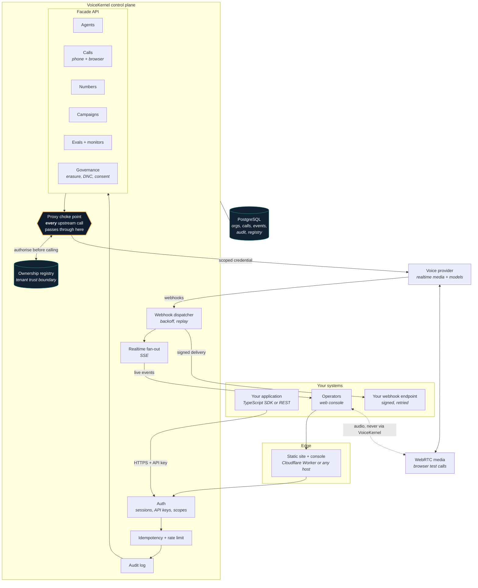
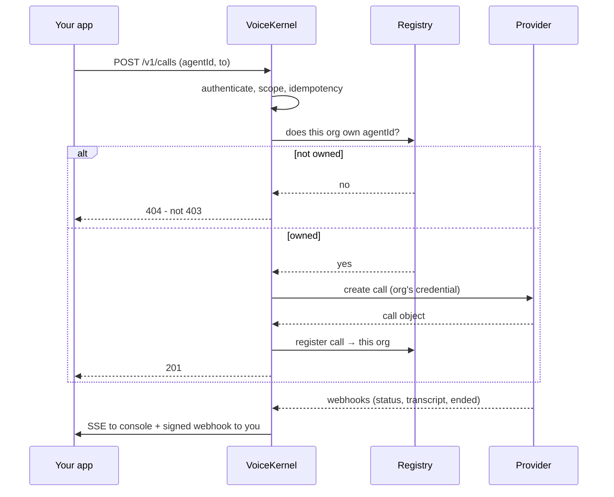

# VoiceKernel

**An open-source, enterprise-ready agentic conversational voice layer.**

VoiceKernel is the control plane you put between your systems and a realtime
voice provider. It gives you multi-tenant isolation, an ownership registry, a
typed API, live call events, and an operator console - so a voice agent becomes
something you can deploy, audit and hand to a compliance team, rather than a
demo that works on one laptop.

It runs on your own infrastructure, against your own provider account, with
your own keys.

```
Status: working software, pre-1.0. The API is stable enough to build on;
        expect additive change before 1.0. See "What is and isn't done".
```

---

## Why this exists

Realtime voice APIs are good at one call. They are not opinionated about the
things that decide whether a voice agent survives contact with an enterprise:

| The problem | What VoiceKernel does |
| --- | --- |
| One provider account, many customers | An ownership registry makes every object belong to exactly one tenant, enforced before the upstream call |
| "Who changed the prompt?" | Every mutating request is audited with actor, resource and request id |
| Right to erasure | Redaction in place, so calls stay auditable while personal data goes |
| A prompt that reads fine and sounds wrong | Talk to any agent from the browser and watch the transcript live |
| Provider lock-in | 17 LLM, 20 voice and 14 transcriber providers are swappable per agent |
| "Is the dashboard stale?" | Provider events stream to the console over SSE as they happen |

---

## Architecture



### The two ideas worth understanding

**1. One choke point.** Every request that reaches the provider goes through
`proxyToProvider`. It resolves the request to a known provider operation,
applies that operation's policy, checks ownership, *then* resolves credentials
and calls upstream. Authorisation deliberately runs **before** credential
resolution - otherwise a deployment with no provider key would answer `503`
where it owed a `404`, leaking that the failure was configuration rather than
permission.

**2. The registry is the tenant boundary.** The provider account has no notion
of your tenants. VoiceKernel records every object it creates and filters every
list against that record. A cross-tenant read returns `404`, never `403`:
confirming existence would tell an attacker the id is real.



---

## Quick start

```bash
git clone https://github.com/VoiceKernel-ai/VoiceKernel.ai.git
cd VoiceKernel.ai
npm install
cp .env.example .env          # set DATABASE_URL, JWT_SECRET, ENCRYPTION_KEY
npm run db:up && npm run migrate
npm run seed                  # prints a generated admin password, once
npm run dev
```

Open `http://localhost:8080/app`.

To place real calls, add a provider key - either platform-wide via
`PROVIDER_API_KEY`, or per organisation in **Settings → Voice provider**, where
it is validated against the provider before being stored and encrypted at rest.
Browser test calls additionally need `PROVIDER_PUBLIC_KEY`; that endpoint
authenticates with the provider's public key, not the private one.

### With the SDK

```ts
import { VoiceKernel } from '@voicekernel/sdk';

const vk = new VoiceKernel({ apiKey: process.env.VOICEKERNEL_API_KEY! });

const agent = await vk.agents.create({
  name: 'Refinance assistant',
  systemPrompt: 'You help homeowners compare refinance options. Be brief.',
  firstMessage: 'Hi - do you have a couple of minutes?',
  model: { provider: 'openai', model: 'gpt-4o' },
  voice: { provider: 'voicekernel', voiceId: 'Elliot' },
});

await vk.calls.create({ agentId: agent.id, to: '+61400000000', phoneNumberId });
```

The SDK is zero-dependency, attaches idempotency keys to creates, never retries
an unkeyed POST, and `verifyWebhook()` throws rather than returning `false` -
a boolean is too easy to ignore.

---

## What you get

**Facade API** - `/v1/agents`, `/calls`, `/phone-numbers`, `/campaigns`,
`/files`, `/evals`, `/analytics`, `/governance`, `/webhook-endpoints`,
`/api-keys`, `/events`, and 13 generated resource collections. Scoped API keys
(`agents:write`, `calls:read`, `provider:passthrough`, …).

**Full provider coverage** - 98 upstream operations are generated from the
vendored OpenAPI document, so "we support everything" is a number the build
checks rather than a claim. Anything not wrapped is still reachable through
`/v1/provider/*`.

**Browser test calls** - a Talk button on every agent, with a live transcript.
Audio goes browser ↔ media vendor directly and never transits VoiceKernel:
nothing to scale, and no recording held that nobody asked for.

**Live console** - provider events reach the screen over SSE in about a second.
The indicator only lights when the stream is genuinely connected.

**Compliance primitives** - audit log, right-to-erasure that redacts in place,
consent capture, DNC hooks, budget and no-dead-line campaign policy.

---

## What is and isn't done

Being explicit is more useful than a feature grid.

**Solid** - tenant isolation and the registry; provider coverage and the
generated catalogue; idempotency; audit; signed webhooks with backoff and
replay; erasure; the SDK; browser test calls; live events.

**Thin** - analytics beyond call basics; eval tooling is a scaffold; campaign
orchestration handles the common path only; there is one migration path and no
downgrades.

**Deliberately absent** - billing integration. The code says so rather than
pretending: budgets are enforced at campaign creation, and nothing in the call
path consults them.

**Single-instance today** - SSE subscribers are held in process. A second API
replica needs Postgres `LISTEN/NOTIFY`; the published payload is kept small and
serialisable so that is a local change. Noted in `src/services/realtime.ts`.

---

## Repository map

```
src/
  provider/     generated operation map + provider catalogue, aliasing
  services/     proxy (the choke point), registry, calls, webhooks, realtime,
                erasure, billing, org
  routes/v1/    the facade API
  middleware/   auth, scopes, idempotency, rate limit, audit
  lib/          agent mapping, crypto, http helpers
db/             SQL migrations, applied in order
web/            marketing site, docs, and the console (no build step)
packages/
  sdk-typescript/  zero-dependency client
deploy/
  cloudflare/   edge worker for static + API proxy
  server/       docker compose, sync script, example reverse-proxy config
scripts/        code generation, seed, migrate, web build
```

---

## Contributing

Start with [CONTRIBUTING.md](CONTRIBUTING.md). In short: `npm run typecheck &&
npm test` must pass, generated files are regenerated rather than hand-edited,
and a change to behaviour wants a test that fails without it.

Good first areas: additional provider adapters, analytics depth, eval tooling,
a Python SDK, `LISTEN/NOTIFY` for multi-instance realtime.

## Security

Please do not open a public issue for a vulnerability. See
[SECURITY.md](SECURITY.md).

## Licence

[MIT](LICENSE).
